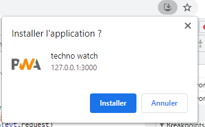
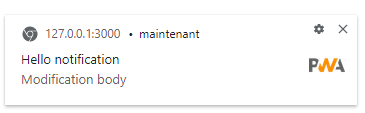
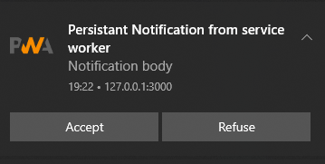
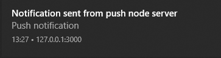
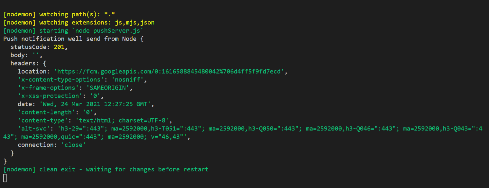

# PWA - Progressive Web Apps

March 2021

> 🔨  Progressive Web Apps: Service workers, Manifest, Cache, Notification Push... From udemy: [Les Progressive Web Apps (PWA) par la pratique - Samir Medjdoub / Code Concept](https://www.udemy.com/course/les-progressive-web-apps-pwa-par-la-pratique)

* * *


Progressive Web Apps are web apps that use emerging web browser APIs and features along with traditional progressive enhancement strategy to bring a native app-like user experience to cross-platform web applications. Progressive Web Apps are a useful design pattern, though they aren't a formalized standard. PWA can be thought of as similar to AJAX or other similar patterns that encompass a set of application attributes, including use of specific web technologies and techniques. This set of docs tells you all you need to know about them.

## Test localy

- Clone
- `npm install`
- `npm run jsonserver` (json with data from client part)
- `npm start` (main application): [http://127.0.0.1:3000/](http://127.0.0.1:3000/)
- `npm run pushserver` (when launched send a push message)

````
-- images
-- vendors
    -- bootstrap.min.css
-- add_techno.html
-- contact.html
-- contact.js
-- index.html
-- main.js
-- manifest.webmanifest
-- pushClientSubscription.json
-- pushServer.js
-- pushServerKeys.json
-- service-worker.js
````

## Concepts

### Service Worker API

Service workers essentially act as proxy servers that sit between web applications, the browser, and the network (when available). They are intended, among other things, to enable the creation of effective offline experiences, intercept network requests and take appropriate action based on whether the network is available, and update assets residing on the server. They will also allow access to push notifications and background sync APIs.

**main.js: start SW**

````js
if (navigator.serviceWorker) {
  navigator.serviceWorker
    .register("service-worker.js")
    .catch((err) => console.error);
}
````

**service-worker.js: check if offline and send response**

````js
self.addEventListener("fetch", (evt) => {
  if (!navigator.online) {
    const headers = { headers: { "Content-Type": "text/html;charset-utf-8" } };
    evt.respondWith(
      new Response("<h2>Pas de connexion internet</h2>", headers)
    );
  }
});
````

### Cache management

**main.js: open cache**

````js
if (window.caches) {
  caches.open("cache watch opened");
  caches.open("cache other opened");
  caches.keys().then(console.log);
}
````

**service-worker.js: put some pages in cache**

````js
self.addEventListener("install", (evt) => {
  console.log("install: ", evt);
  const cachePromise = caches.open(cacheName).then((cache) => {
    return cache.addAll([
      "index.html",
      "main.js",
      "style.css",
      "vendors/bootstrap.min.css",
      "add_techno.html",
      "add_techno.js",
      "contact.html",
      "contact.js",
    ]);
  });
  evt.waitUntill(cachePromise);
});
````

**service-worker.js: Strategy 1: Cache only with Network Fallback**

````js
self.addEventListener("fetch", (evt) => {
 evt.respondWith(
    caches.match(evt.request).then((res) => {
      // cache
      if (res) {
        return res;
      }
      // otherwise network
      return fetch(evt.request).then((newResponse) => {
        caches
          .open(cacheName)
          .then((cache) => cache.put(evt.request, newResponse));
        return newResponse.clone(); // we can't send the same response twice so we clone it
      });
    })
  );
});
````

**service-worker.js: Strategy 2: Network first with cache fallback**
````js
evt.respondWith(
    fetch(evt.request)
      // from network to cache
      .then((res) => {
        console.log(`fetched url from network: ${evt.request.url}`);
        caches.open(cacheName).then((cache) => cache.put(evt.request, res));
        return res.clone();
      })
      // otherwhise cache
      .catch((err) => {
        console.log(`fetched url from cache: ${evt.request.url}`);
        return caches.match(evt.request);
      })
  );
````

**service-worker.js: Delete older instances in cache**

````js
self.addEventListener("activate", (evt) => {
  console.log("activate: ", evt);
  // delete older instances in cache
  let cacheCleanedPromise = caches.keys().then((keys) => {
    keys.forEach((key) => {
      if (key !== cacheName) {
        return caches.delete(key);
      }
    });
  });
  evt.waitUntill(cacheCleanedPromise);
});
````

### Manifest

The web app manifest provides information about a web application in a JSON text file, necessary for the web app to be downloaded and be presented to the user similarly to a native app (e.g., be installed on the homescreen of a device, providing users with quicker access and a richer experience). PWA manifests include its name, author, icon(s), version, description, and list of all the necessary resources (among other things).

**manifest.json**

````json
{
  "theme_color": "#f69435",
  "background_color": "#f69435",
  "display": "standalone",
  "scope": "/",
  "start_url": "/",
  "name": "techno watch",
  "short_name": "tecnho-watch",
  "icons": [
    {
      "src": "images/icons/icon-72x72.png",
      "sizes": "72x72",
      "type": "image/png"
    },
    {
      "src": "images/icons/icon-96x96.png",
      "sizes": "96x96",
      "type": "image/png"
    },
    {
      "src": "images/icons/icon-128x128.png",
      "sizes": "128x128",
      "type": "image/png"
    },
    {
      "src": "images/icons/icon-144x144.png",
      "sizes": "144x144",
      "type": "image/png"
    },
    {
      "src": "images/icons/icon-152x152.png",
      "sizes": "152x152",
      "type": "image/png"
    },
    {
      "src": "images/icons/icon-192x192.png",
      "sizes": "192x192",
      "type": "image/png"
    },
    {
      "src": "images/icons/icon-256x256.png",
      "sizes": "256x256",
      "type": "image/png"
    },
    {
      "src": "images/icons/icon-384x384.png",
      "sizes": "384x384",
      "type": "image/png"
    },
    {
      "src": "images/icons/icon-512x512.png",
      "sizes": "512x512",
      "type": "image/png"
    }
  ]
}
````



### Notification

- Non-persistent: Sent via a web application (automatically close)
- Persistent: Sent via Service Worker/Push API (stay in notification center)

#### Non persistant - from main.js

````js
if (window.Notification && window.Notification !== "denied") {
  Notification.requestPermission((perm) => {
    if (perm === "granted") {
      const options = {
        body: "Modification body",
        icon: "images/icons/icon-72x72.png",
      };
      const notif = new Notification("Hello notification", options);
    } else {
      console.log("Authorization of notifications refused");
    }
  });
}
````



#### Persistant - from service-worker.js

````js
self.registration.showNotification(
  "Persistant Notification from service worker",
  {
    body: "Notification body",
    icon: "images/icons/icon-72x72.png",
  }
);
````

#### Persistant with actions - from service-worker.js

````js
self.registration.showNotification(
  "Persistant Notification from service worker",
  {
    body: "Notification body",
    icon: "images/icons/icon-72x72.png",
    actions: [
      { action: "accept", title: "Accept" },
      { action: "refuse", title: "Refuse" },
    ],
  }
);
````



### Push event (notification from Push Server)

#### Test push in DevTool

````js
self.addEventListener("push", (evt) => {
  console.log("push event: ", evt);
  console.log("push event data: ", evt.data.text());
  const title = evt.data.text();
  evt.waitUntil(
    self.registration.showNotification(title, {
      body: "Push notification",
      image: "images/icons/icon-96x96.png",
    })
  );
});
````

Test using DevTool: Application / Service workers / Push

#### Step 1: Generate Vapid Key

Using dependancies web-push.

`web-push generate-vapid-keys --json`

Output: {"publicKey":"xxxxx","privateKey":"xxxxx"}

Or to put it in a Json file:

`web-push generate-vapid-keys --json > pushServerKeys.json`

#### Step 2: Subscription (ask to Firebase Cloud Messaging (FCM) and FCM send it)

**main.js**

*Subscription*

````js
if ("serviceWorker" in navigator) {
  window.addEventListener("load", function () {
    navigator.serviceWorker
      .register("service-worker.js")
      .then((registration) => {
        // Public vapid key - should be send using server
        const publicKey =
          "BGM2Ld5GpBXX-sc47KbdsMphvA8f_Vmd3e88lmF2fw3qxmGmuhLf1NkifelEK9PsMsV9A_DouB8Psz-94MO9iCk";
        registration.pushManager.getSubscription().then((subscription) => {
          if (subscription) {
            console.log("Already suscribed: ", subscription);
            extractKeysFromArrayBuffer(subscription);
            return subscription;
          } else {
            // ask for subscription
            const convertKey = urlBase64ToUint8Array(publicKey);
            return registration.pushManager
              .subscribe({
                userVisibleOnly: true,
                applicationServerKey: convertKey,
              })
              .then((newSubscription) => {
                console.log("New subscription: ", newSubscription);
                extractKeysFromArrayBuffer(subscription);
                return subscription;
              });
          }
        });
      });
  });
}

function extractKeysFromArrayBuffer(subscription) {
  // no more keys proprety directly visible on the subscription objet. So you have to use getKey()
  const keyArrayBuffer = subscription.getKey("p256dh");
  const authArrayBuffer = subscription.getKey("auth");
  const p256dh = btoa(
    String.fromCharCode.apply(null, new Uint8Array(keyArrayBuffer))
  );
  const auth = btoa(
    String.fromCharCode.apply(null, new Uint8Array(authArrayBuffer))
  );
  console.log("p256dh key", keyArrayBuffer, p256dh);
  console.log("auth key", authArrayBuffer, auth);
}
````

*When using your VAPID key in your web app, you'll need to convert the URL safe base64 string to a Uint8Array to pass into the subscribe call, which you can do like so:*

````js
function urlBase64ToUint8Array(base64String) {
  const padding = "=".repeat((4 - (base64String.length % 4)) % 4);
  const base64 = (base64String + padding).replace(/-/g, "+").replace(/_/g, "/");

  const rawData = window.atob(base64);
  const outputArray = new Uint8Array(rawData.length);

  for (let i = 0; i < rawData.length; ++i) {
    outputArray[i] = rawData.charCodeAt(i);
  }
  return outputArray;
}
````

#### Step 3: Push server Node (that will send push notififaction to clients who suscribed in step 2)

**pushClientSubscription.json**

Data retrieved using console log from *main.js*.

````json
{
  "endpoint": "https://fcm.googleapis.com/fcm/send/fehEIzpuc00:APA91bGYHQQ_H6NWVqIIqq_bdy4u3gLGymyJrAy63nYrSMOX2zX2_HvMRkXn1j5nOzk08KnFu0VZbCkoCZIFyzJ_Lplra9BYCI3VFUvxWcLKZRfST30tQdGYxRlIsCis2HXZlW2MFJlQ",
  "keys": {
    "auth":"UrB1eoR6Zz35Lqv+lPgBZg==",
    "p256dh":"BPW+3NNxLwndYRorD6VEgv1bhO2L1I1jpHC0IBlKakWOY36gsYsdxVGdTmsCaMn+6xpLCL8rpGuRsEg81goACns="
  }
}
````

**pushServerKeys.json**

````json
{
  "publicKey": "BGM2Ld5GpBXX-sc47KbdsMphvA8f_Vmd3e88lmF2fw3qxmGmuhLf1NkifelEK9PsMsV9A_DouB8Psz-94MO9iCk",
  "privateKey": "wlydFgZrBka4uXdgrH4AzHknBgBtK8_s38uB5V2uX5Q"
}
````

**pushServer.js**

````js
const webPush = require("web-push");
const pushServerKeys = require("./pushServerKeys.json");
const pushClientSubscription = require("./pushClientSubscription.json");

webPush.setVapidDetails(
  "mailto:vincent.chilot@gmail.com",
  pushServerKeys.publicKey,
  pushServerKeys.privateKey
);

const subscription = {
  endpoint: pushClientSubscription.endpoint,
  keys: {
    auth: pushClientSubscription.keys.auth,
    p256dh: pushClientSubscription.keys.p256dh,
  },
};

webPush
  .sendNotification(subscription, "Notification sent from push node server")
  .then((res) => console.log("Push notification well send from Node", res))
  .catch((err) => console.error);

````





## Dependancies

- [live-server](https://www.npmjs.com/package/live-server): This is a little development server with live reload capability. Use it for hacking your HTML/JavaScript/CSS files, but not for deploying the final site.

`npm i live-server`

- [json-server](https://www.npmjs.com/package/json-server): Get a full fake REST API with zero coding in less than 30 seconds .

`npm i json-server`

`live-server --port=3000`

To launch server on a json, here *db.json*:

`json-server -p 3001 --watch db.json`

Online version [https://raigyo-pwa-json.herokuapp.com/technos](https://raigyo-pwa-json.herokuapp.com/technos)

- [web-push](https://www.npmjs.com/package/web-push): Web push requires that push messages triggered from a backend be done via the Web Push Protocol and if you want to send data with your push message, you must also encrypt that data according to the Message Encryption for Web Push spec.

`npm i web-push`

`npm i web-push -g`


## Useful links

- [codeconcept/pwa_veilletechno](https://github.com/codeconcept/pwa_veilletechno)
- [codeconcept/nodetestapi](https://github.com/codeconcept/nodetestapi)
- [Progressive web apps (PWAs)](https://developer.mozilla.org/en-US/docs/Web/Progressive_web_apps)
- [Service Worker API](https://developer.mozilla.org/en-US/docs/Web/API/Service_Worker_API)
- [ExtendableEvent.waitUntil()](https://developer.mozilla.org/en-US/docs/Web/API/ExtendableEvent/waitUntil)
- [Web app manifests](https://developer.mozilla.org/en-US/docs/Web/Manifest)
- [PWA Manifest Generator](https://www.simicart.com/manifest-generator.html/)
- [Notifications API: Advanced Progressive Web Apps](https://www.thinktecture.com/en/pwa/push-notifications-api/)
- [My JSON Server](https://my-json-server.typicode.com/)
- [jesperorb/json-server-heroku](https://github.com/jesperorb/json-server-heroku)
- [idb.js/database.js](https://glitch.com/edit/#!/dream-catcher?path=README.md%3A1%3A0)
- [Send messages when you’re back online with Service Workers and Background Sync](https://www.twilio.com/blog/2017/02/send-messages-when-youre-back-online-with-service-workers-and-background-sync.html)
